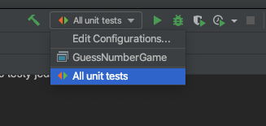
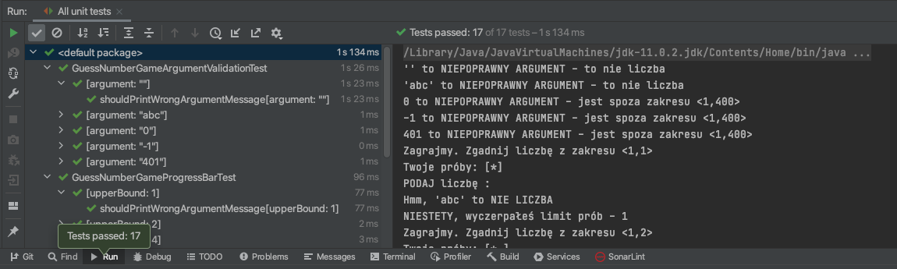

# Sprawdzanie rozwiązania

Stan swojego rozwiązania można sprawdzić uruchamiając testy jednostkowe w projekcie i analizując ich wyniki. 
Rozwiąznie jest poprawne, jeżli wszystkie testy kończą się pozytywnie.

Testy można uruchamiać wielokrotnie.

## Testy jednostkowe w IntelliJ IDEA

* Wybierz polecenie _All unit tests_ w liście _Run/Debug configurations_.



Jeżeli lista jest pusta, to otwórz poanel _Run/Edit Configurations..._ i kliknij _OK_.

* Uruchom polecenie klikając ikonę obok listy; przykładowy rezultat:


  

## Testy jednostkowe z linii poleceń

* Upewnij się, że masz zainstalowane narzędzie Maven, uruchamiając polecenie 
`mvn -version`; przykładowy rezultat:

```shell
>mvn -version
Apache Maven 3.6.3 (cecedd343002696d0abb50b32b541b8a6ba2883f)
Maven home: /opt/apache-maven-3.6.3
Java version: 11.0.2, vendor: Oracle Corporation, runtime: /Library/Java/JavaVirtualMachines/jdk-11.0.2.jdk/Contents/Home
Default locale: en_PL, platform encoding: UTF-8
OS name: "mac os x", version: "10.15.7", arch: "x86_64", family: "mac"
```

* Zainstaluj narzędzie Maven, zgodnie z [instruckją](http://maven.apache.org/install.html), jeżeli nie jest zainstalowane
* Uruchom polecenie `mvn test` w głównym katalogu projektu; przykładowy rezultat:

```shell
>mvn test
[INFO] Scanning for projects...
(...)
-------------------------------------------------------
 T E S T S
-------------------------------------------------------
(...)
Results :

Tests run: 17, Failures: 0, Errors: 0, Skipped: 0

[INFO] ------------------------------------------------------------------------
[INFO] BUILD SUCCESS
[INFO] ------------------------------------------------------------------------
[INFO] Total time:  3.920 s
[INFO] Finished at: 2021-02-12T16:48:34+01:00
[INFO] ------------------------------------------------------------------------
```
