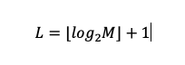

# Za dużo, za mało

Przedmiotem zadania jest zaimplementowanie gru _"Za dużo, za mało" z limitem prób dla gracza.

## Na czym polega gra

* Gracz ustala przedział, w którym znajduje się liczba do odgadnięcia, przez podanie górnego zakresu przedziału `M`.
* Program losuję liczbę z zakresu `<1,M>`.
* Gracz ma ograniczoną liczbę prób `L` na odgadnięcie liczby. Limit prób obliczany jest wg wzoru:



* Podczas każdej próby gracz podaje swoją propozycję, a program informuje go czy zgadł albo podał za dużą lub za małą liczbę.

## Jakie wymagania musi spełnić program

Aby umożliwić automatyczne sprawdzanie rozwiązania, zaimplementowany program musi spełniać następujące wymagania:

1. Zakres `M` podawany jest jako argument programu. Jeżeli argument nie jest liczbą całkowitą lub jest spoza zakresu <1,**400**>:
    1. Program wypisuje linię zawierającą tekst `"NIEPOPRAWNY ARGUMENT"`.
    1. Konstruktor `efs.task.syntax.GuessNumberGame.GuessNumberGame` rzuca wyjątek klasy `java.lang.IllegalArgumentException`.
1. Program w pierwszej lini wypisuje linię zawierającą teskt z zakresem odgadywanej liczby <1,M>, np.: `"<1,100>"`
1. Każda próba przebiega w następujący sposób:
    1. Program wypisuje linię zawierającą _pasek postępu_ pokazujący ilość prób gracza. Pasek postępu zbudowany jest z następujących znaków:
        1. `'['`
        1. `'*'` - powtórzony tyle razy, ile prób już miał gracz, włącznie z aktualną próbą
        1. `'.'` - powtórzony tyle razy, ile prób zostało graczowi
        1. `']'`
    
        Przykładowy _pasek postępu_: `"[***...]"`
    1. Program wypisuje linię zawierającą teskt `"PODAJ"`.
    1. Gracz podaje swój typ:
        1. Jeżeli podany tekst nie jest liczbą, program wypisuje linię zawierającą tekst `"NIE LICZBA"`.
        1. Jeżeli podana liczba jest większa niż zgadywana, program wypisuje linię zawierającą tekst `"ZBYT WIELE"`.
        1. Jeżeli podana liczba jest mniejsza niż zgadywana, program wypisuje linię zawierającą tekst `"NIE WYSTARCZY"`.
        1. Jeżeli podana liczba jest równa zgadywanej, program wypisuje linię zawierającą tekst `"TAK"` i próby się kończą.
1. Po wyczerpaniu prób:
    1. Jeżeli gracz odgadł liczbę, program wypisuje linię zawierającą teskt `"GRATULACJE"`.
    1. Jeżeli gracz nie odgadł liczby, program wypisuje linię zawierającą teskt `"NIESTETY"`.
1. Program, wszelkie wymagane linie wypisuje na standardowe wyjście `java.lang.System.out`.
2. Typy gracza podawane podczas każdej próby odczytywane są ze standardowego wejścia `java.lang.System.in`.

Teksty sprawdzane przez automatyczny system oceniania zdefiniowane są jako stałe w klasie `efs.task.syntax.UsefulConstants`.

## Przykładowe zapisy uruchomienia gry

```shell
>java -cp target/classes efs.task.syntax.GuessNumberGame napis
'napis' to NIEPOPRAWNY ARGUMENT - to nie liczba
```

```shell
>java -cp target/classes efs.task.syntax.GuessNumberGame -5   
-5 to NIEPOPRAWNY ARGUMENT - jest spoza zakresu <1,400>
```

```shell
java -cp target/classes efs.task.syntax.GuessNumberGame 100
Zagrajmy. Zgadnij liczbę z zakresu <1,100>
Twoje próby: [*......]
PODAJ liczbę :
50
To NIE WYSTARCZY
Twoje próby: [**.....]
PODAJ liczbę :
75
To ZBYT WIELE
Twoje próby: [***....]
PODAJ liczbę :
63
To ZBYT WIELE
Twoje próby: [****...]
PODAJ liczbę :
57
To ZBYT WIELE
Twoje próby: [*****..]
PODAJ liczbę :
54
TAK!
GRATULACJE, 5 - tyle prób zajęło Ci odgadnięcie liczby 54
```

```shell
>java -cp target/classes efs.task.syntax.GuessNumberGame 80
Zagrajmy. Zgadnij liczbę z zakresu <1,80>
Twoje próby: [*......]
PODAJ liczbę :
10
To ZBYT WIELE
Twoje próby: [**.....]
PODAJ liczbę :
czerdzieści
Hmm, 'czerdzieści' to NIE LICZBA
Twoje próby: [***....]
PODAJ liczbę :
50
To ZBYT WIELE
Twoje próby: [****...]
PODAJ liczbę :
20
To ZBYT WIELE
Twoje próby: [*****..]
PODAJ liczbę :
11
To ZBYT WIELE
Twoje próby: [******.]
PODAJ liczbę :
9
To ZBYT WIELE
Twoje próby: [*******]
PODAJ liczbę :
8
To ZBYT WIELE
NIESTETY, wyczerpałeś limit prób (7) do odgadnięcia liczby 2
```